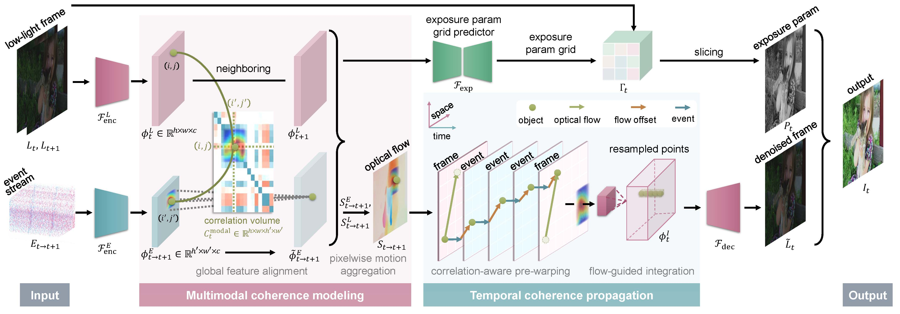

## RCNet: Deep Recurrent Collaborative Network for Multi-View Low-Light Image Enhancement

[Paper](https://github.com/hluo29/RCNet) | [Project Page](https://github.com/hluo29/RCNet)

[Hao Luo](https://github.com/hluo29/RCNet)1, [Baoliang Chen](https://baoliang93.github.io/)2, [Lingyu Zhu](https://github.com/hluo29/RCNet)1, [Peilin Chen](https://github.com/hluo29/RCNet)1, [Shiqi Wang](https://scholar.google.com.hk/citations?hl=en&user=Pr7s2VUAAAAJ&view_op=list_works&sortby=pubdate)1

1City University of Hong Kong 2South China Normal University

    

---

    

:star:If RCNet is helpful for you, please help star this repo. Thanks!:hugs:

## Table Of Contents

- [TODO](#todo)
- [Data Preparation](#data)
- [Training](#training)
- [Inference](#inference)

## TODO

- [x] Release inference code and pretrained models.
- [x] Update links to paper and project page.
- [x] Provide a runtime environment Docker image.
- [ ] Release train code and training set.

The code and pretrained model will be made available soon.

Google Driver of MVLT Dataset: https://drive.google.com/drive/folders/1QR5TgocnWFGx2Qk75yEfqmJwvnD2CqWx?usp=sharing
